# Cell types

## TextCell — `add_text()`

Text with Markdown and LaTeX support (via MathJax plugin).

```python
slide.add_text(
    "### Title\n\nText with **bold**, *italic*, LaTeX: $E = mc^2$ "
    "and markdown list:\n\n"
    "- item 1\n "
    "- item 2\n "
    "- item 3\n "
    "  - item 3.1",
    markdown=True,   # default — False delivers raw HTML
    caption="Source: internal report",
)
```

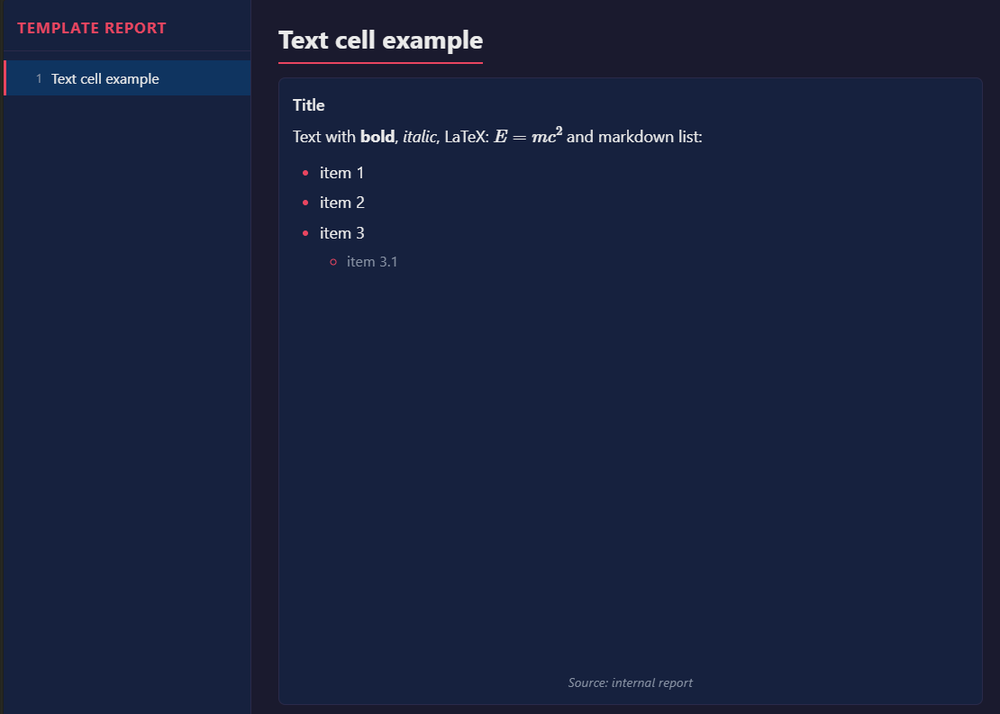

---

## MetricCell — `add_metric()`

KPI card with a large value, a label, and an optional delta.

```python
slide.add_metric(
    value=98.7,
    label="Efficiency (%)",
    delta=+2.3,             # positive → green, negative → red
    delta_label="vs previous month",
)
```

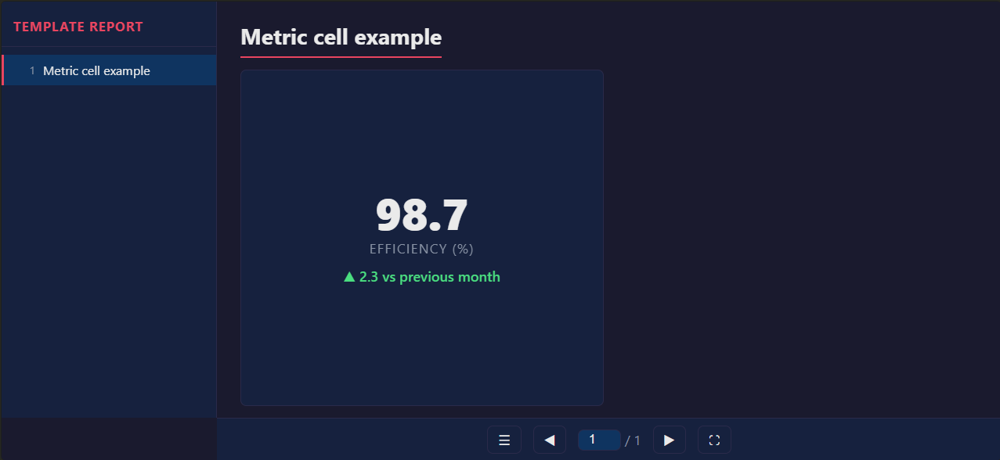

---

## TableCell — `add_table()`

Accepts CSV, dict, `list[list]`, or `pd.DataFrame`.

```python
# CSV (separator auto-detected)
slide.add_table("""Component,Jan,Feb,Mar
Motor A,98.1,97.8,98.7
Motor B,94.3,95.1,96.2""")

# dict
slide.add_table({"Name": ["Motor A", "Motor B"], "Status": ["OK", "OK"]})

# DataFrame
import pandas as pd
slide.add_table(pd.read_csv("data.csv"))
```

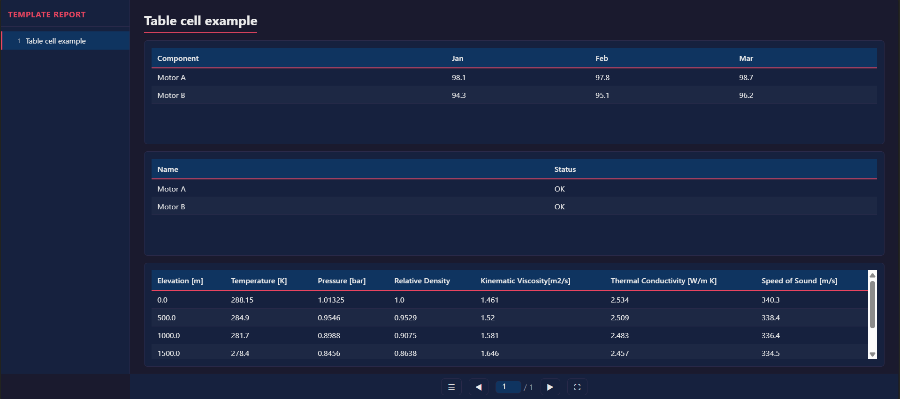

---

## ImageCell — `add_image()`

Image with lightbox (zoom/pan). Accepts a local path, URL, or base64 string.

```python
slide.add_image(
    "results/chart.png",
    lightbox=True,           # default
    caption="Fig. 1 — Failure distribution",
)
```

In `self_contained=True` mode, local images are embedded as base64.

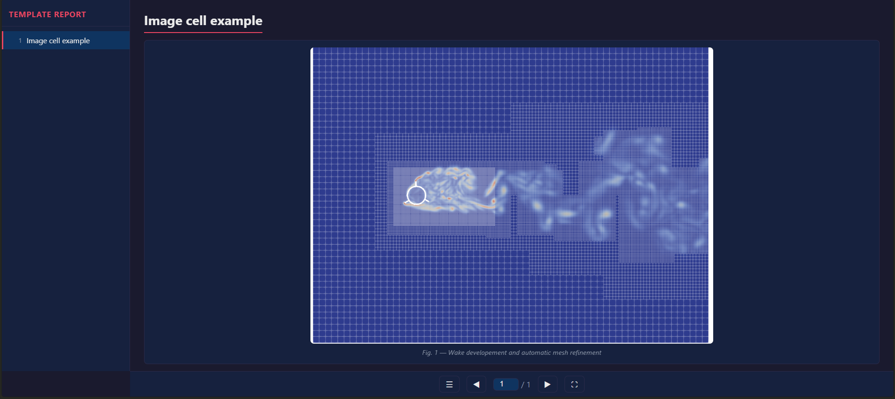

---

## ImageSliderCell — `add_image_slider()`

Image carousel with prev/next buttons and lightbox.

```python
slide.add_image_slider(
    ["img1.png", "img2.png", "img3.png"],
    captions=["Front view", "Side view", "Detail"],
    caption="Visual inspection — 3 samples",
)
```

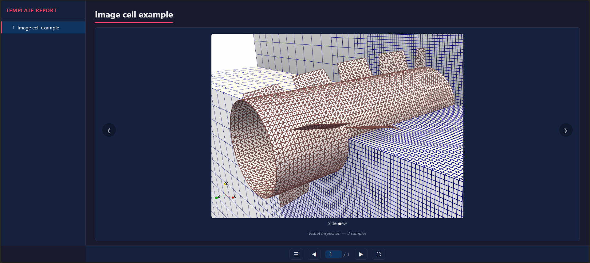

---

## ListCell — `add_list()`

Bullet or numbered list, with support for nested sub-levels.

```python
slide.add_list(
    ["Analysis", "Design", "Implementation", "Testing"],
    ordered=True,
    caption="Project phases",
)

# With sub-levels
slide.add_list([
    "Analysis",
    {"Design": ["UX", "Backend", "Database"]},
    "Implementation",
])
```

Although we can create lists using markdown on `Text` cells, the `add_list` method
may be more straight forward to add items from code data structures, instead of relying
on string interpolation.

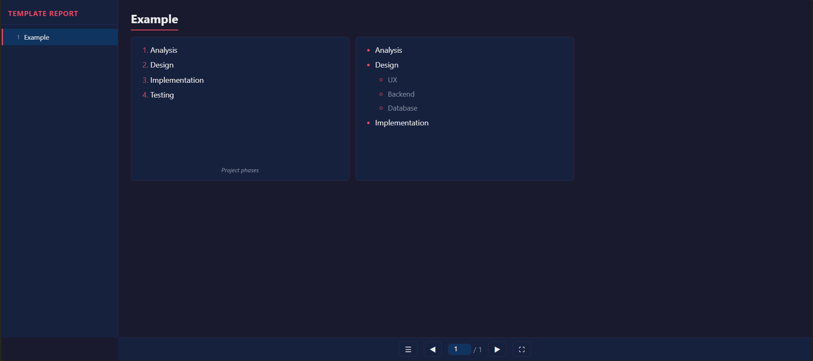

---

## CodeCell — `add_code()`

Code block with syntax highlighting via Highlight.js.
Requires `Plugin("highlight", "cdn")`.

```python
slide.add_code(
    "def hello():\n    return 'world'",
    language="python",     # python, sql, javascript, bash, ...
    copy_button=True,
)
```

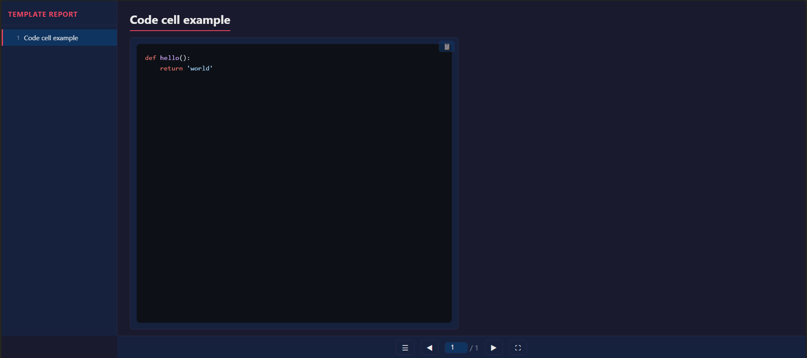

---

## PlotlyCell — `add_plotly()`

Interactive Plotly figure embedded as JSON.
Requires `Plugin("plotly", "cdn")`.

```python
import plotly.express as px

fig = px.scatter(px.data.iris(), x="sepal_width", y="sepal_length", color="species")
slide.add_plotly(fig, caption="Iris Dataset")
```

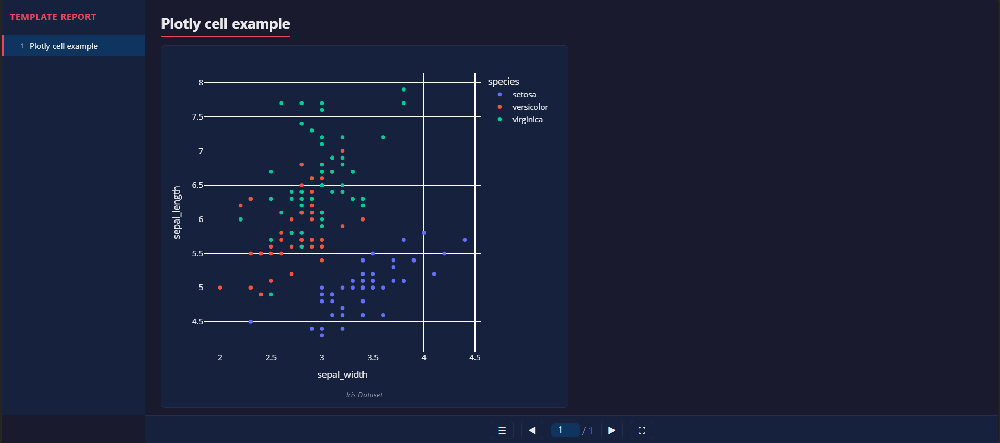

---

## MermaidCell — `add_mermaid()`

Declarative diagram (flowchart, sequenceDiagram, gantt, etc.).
Requires `Plugin("mermaid", "cdn")`.

```python

slide = slides.add_slide("Example", nrows=2, ncols=2, row_heights=['2fr', '1fr'])

slide.add_mermaid("""
---
title: Simple sample
---
stateDiagram-v2
    [*] --> Still
    Still --> [*]

    Still --> Moving
    Moving --> Still
    Moving --> Crash
    Crash --> [*]
""")

slide.add_mermaid("""
---
config:
  pie:
    textPosition: 0.5
  themeVariables:
    pieOuterStrokeWidth: "5px"
---
pie showData
    title Key elements in Product X
    "Calcium" : 42.96
    "Potassium" : 50.05
    "Magnesium" : 10.01
    "Iron" :  5
""")

slide.add_mermaid("""
gantt
    title A Gantt Diagram
    dateFormat YYYY-MM-DD
    section Section
        A task          :a1, 2014-01-01, 30d
        Another task    :after a1, 20d
    section Another
        Task in Another :2014-01-12, 12d
        another task    :24d
""", colspan=2, row=2, col=1)

```

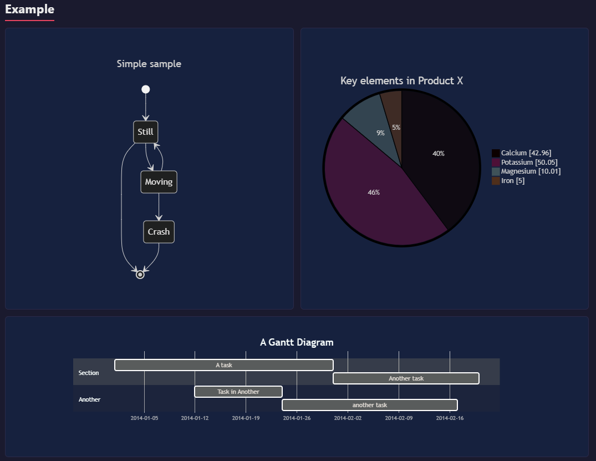

---

## HtmlCell — `add_html()`

Raw HTML injected without escaping — full styling freedom.

```python
slide = slides.add_slide('HTML Cell example', ncols=2, nrows=2)
slide.add_html("""
<div style="padding:1rem; display:flex; flex-direction:column; gap:0.75rem;
            font-family:sans-serif;">

  <div style="display:flex; gap:0.75rem; align-items:flex-start; padding:0.85rem 1rem;
              background:#f0fdf4; border:1px solid #bbf7d0; border-radius:8px;">
    <span style="font-size:1.2rem">&#x2705;</span>
    <div>
      <div style="font-weight:600; color:#15803d">Deploy v2.4.1 — successful</div>
      <div style="font-size:0.82rem; color:#166534">All regions live · 0 errors detected</div>
    </div>
  </div>

  <div style="display:flex; gap:0.75rem; align-items:flex-start; padding:0.85rem 1rem;
              background:#fffbeb; border:1px solid #fde68a; border-radius:8px;">
    <span style="font-size:1.2rem">&#x26A0;&#xFE0F;</span>
    <div>
      <div style="font-weight:600; color:#b45309">Node 3 — memory at 87%</div>
      <div style="font-size:0.82rem; color:#92400e">Consider scaling or restarting</div>
    </div>
  </div>

  <div style="display:flex; gap:0.75rem; align-items:flex-start; padding:0.85rem 1rem;
              background:#fef2f2; border:1px solid #fecaca; border-radius:8px;">
    <span style="font-size:1.2rem">&#x1F534;</span>
    <div>
      <div style="font-weight:600; color:#b91c1c">DB timeout — us-east-1</div>
      <div style="font-size:0.82rem; color:#991b1b">Failover in progress · ETA 3 min</div>
    </div>
  </div>

</div>
""")
```

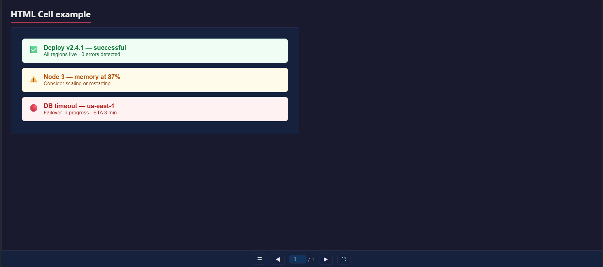

---

## IframeCell — `add_iframe()`

Embed external content via `<iframe>`. Requires an internet connection.

```python
slide.add_iframe(
    "https://www.openstreetmap.org/export/embed.html?bbox=...",
    caption="Location map",
)
```

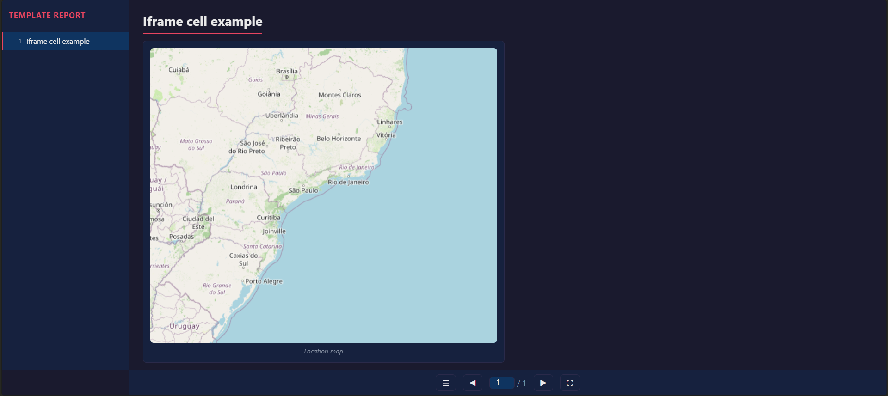


---

## EmptyCell — `add_empty()`

Reserves grid space without rendering any content. Useful for asymmetric layouts.

```python
slide = slides.add_slide("Example", nrows=2, ncols=2)
slide.add_metric(value=42, label="KPI", rowspan=2)  # col 1, rows 1 and 2
slide.add_text("Text")                               # col 2, row 1
slide.add_empty()                                    # col 2, row 2 — empty space
```

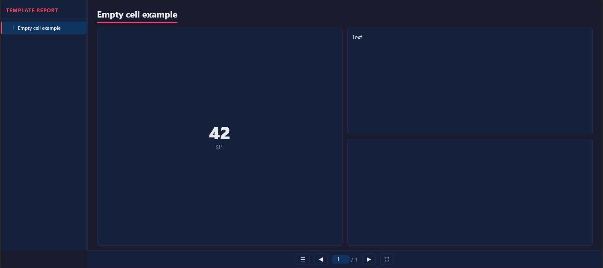